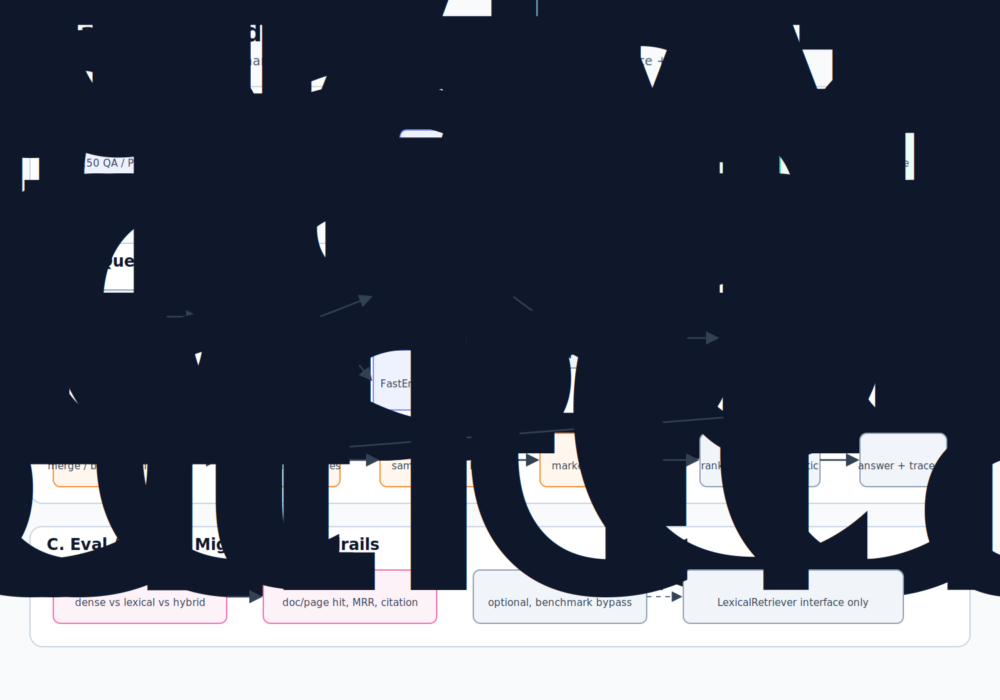
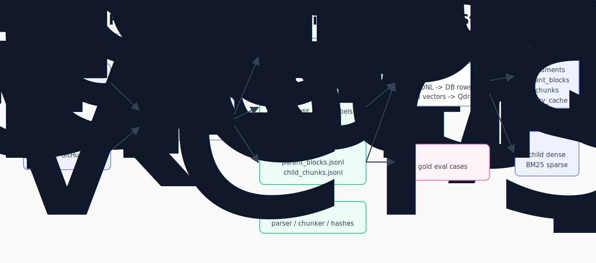

# V1 实际架构：Atlas Hybrid Kernel

更新时间：2026-05-04

本文档面向第一次接触这个仓库的人。读完后，你应该能回答三个问题：

```text
1. V1 这个版本到底做了什么？
2. 一个问题从输入到答案，中间经过哪些组件？
3. 每个组件为什么存在、输入是什么、输出是什么、底层原理是什么？
```

如果你已经熟悉 RAG、hybrid retrieval、reranker 和 FinanceBench，可以直接看：

```text
docs/exec-plans/milestone/v1_hybrid_kernel_milestone.md
benchmarks/rag_quality/financebench/reports/full_v1_retrieval_experiment.md
```

## 1. V1 一句话解释

V0 的 Atlas 只能做 dense-only 检索：把用户问题和文档 chunk 都变成向量，然后找向量最相似的 chunk。

V1 的 Atlas Hybrid Kernel 做的是：

```text
用 Dense 检索找“语义相近”的文本，
用 BM25 检索找“关键词精确命中”的文本，
用 RRF 把两路候选合并，
用本地 reranker 重新精排，
再把命中的小 chunk 扩展回可读的 parent evidence，
最后用 Critic Lite、citation、cache 和 trace 增强可靠性和可调试性。
```

这件事的目标不是“组件更多”，而是让系统更有证据地回答金融文档问题。

FinanceBench 这类问题经常长这样：

```text
What is the FY2018 capital expenditure amount for 3M?
```

这个问题同时需要：

```text
语义理解：capital expenditure 是财务指标。
关键词匹配：3M、FY2018、capital expenditure 这些词不能丢。
精确页定位：答案往往在某一页表格里。
引用回溯：最后必须知道答案来自哪个 document、哪个 page。
```

所以 V1 不再只靠 dense vector，而是引入 hybrid retrieval。

## 2. 总体架构图



从最高层看，V1 分成两条路径。

第一条是离线准备路径：

```text
FinanceBench PDF
  -> 解析 PDF
  -> 生成 parent blocks 和 child chunks
  -> 导入 Postgres / Qdrant
```

第二条是在线查询路径：

```text
用户问题
  -> query normalization
  -> cache lookup
  -> dense retrieval
  -> BM25 retrieval
  -> RRF fusion
  -> reranker
  -> parent evidence packer
  -> Critic Lite
  -> answer generator
  -> citation builder
  -> trace / cache write
```

## 3. 数据生命周期：JSONL 不是运行时存储



这里最容易误解的一点是：`pages.jsonl`、`parent_blocks.jsonl`、`child_chunks.jsonl` 不是线上查询时读取的数据库。

它们只是 FinanceBench 测评用的冻结中间产物。

为什么需要这些 JSONL？

```text
因为 benchmark 必须可复现。
同一份 PDF、同一种解析方式、同一种 chunking 规则，应该生成同样的 parent_id / chunk_id。
这样我们后面比较 dense、BM25、hybrid、reranker 时，变量才不会混在一起。
```

准备阶段输出：

```text
corpus/financebench/manifest.jsonl
corpus/financebench/parsed/pages.jsonl
corpus/financebench/parsed/parent_blocks.jsonl
corpus/financebench/parsed/child_chunks.jsonl
corpus/financebench/corpus_version.json
evals/financebench_cases.yaml
```

导入阶段会把这些冻结产物写入真正的运行时存储：

```text
Postgres:
  documents        文档元数据
  parent_blocks    可读证据块
  chunks           检索小块
  query_runs       查询记录
  retrieval_events 检索事件
  generation_events 生成事件
  query_cache      exact cache

Qdrant:
  dense child vectors
  BM25 sparse child vectors
```

线上 query 读取的是 Postgres + Qdrant，不读取 JSONL。

代码位置：

```text
src/atlas/datasets/financebench.py
src/atlas/datasets/financebench_importer.py
scripts/prepare_financebench.py
scripts/ingest_financebench.py
```

## 4. 在线查询总流程

假设用户问：

```text
What is the FY2018 capital expenditure amount for 3M?
```

V1 的处理流程是：

```text
1. QueryRuntime 接收问题。
2. 生成 normalized query，用于 cache key 和检索。
3. 先查 Postgres query_cache，看是否有完全相同配置下的答案。
4. DenseRetriever 把 query 变成向量，在 Qdrant 找语义相近 chunk。
5. BM25Retriever 用关键词在 Qdrant sparse vector 中找精确匹配 chunk。
6. RRF Fusion 把 dense 和 BM25 的候选合并成一个候选池。
7. Reranker 逐个判断候选 chunk 和问题是否真正相关，重新排序。
8. Parent Resolver 用 child chunk 找回 parent block。
9. Evidence Packer 把 parent block 打包成 c1 / c2 / c3。
10. Critic Lite 在生成前检查证据是否为空或明显不匹配。
11. Answer Generator 只基于 evidence 生成答案。
12. Citation Builder 解析答案里的 [c1] / [c2]。
13. Critic Lite 在生成后检查引用和数字是否可被证据支持。
14. Trace Logger 写入查询过程。
15. 如果答案 supported，写入 exact cache。
```

## 5. Parent-Child RAG：为什么检索小块，展示大块

### 它解决什么问题

如果直接把整页财报作为检索单位，文本太长，向量会变得模糊。

如果只把很小的 chunk 交给模型，模型可能看不到表格上下文、单位、年份或相邻行。

所以 V1 使用 parent-child RAG：

```text
ChildChunk 用来检索。
ParentBlock 用来展示、引用和生成答案。
```

### 输入

```text
PDF page text
page number
document metadata
```

### 输出

```text
ParentBlock:
  parent_id
  document_id
  page_start
  page_end
  text
  child_ids_json

ChildChunk:
  chunk_id
  parent_id
  document_id
  page_start
  page_end
  text
```

### 小例子

一页 3M 年报里可能有一段现金流表：

```text
Purchases of property, plant and equipment ... 2018: 1,577
```

系统会把整页作为 parent：

```text
parent_id = fbpar_..._p0060
page_start = 60
text = 整页可读文本
```

然后把页面切成 child chunks：

```text
chunk_id = fbchk_..._00109
parent_id = fbpar_..._p0060
text = 包含 Purchases of property, plant and equipment 的局部文本
```

检索先命中 child，最后再回到 parent。

### 取舍

```text
收益：检索更精确，证据展示更完整。
成本：ingestion 必须维护 parent_id / child_id 的稳定关系。
```

## 6. Embedding 与 Dense Retrieval：用“语义距离”找文本

### Embedding 是什么

Embedding 是把文本变成一串数字向量。

这串数字不是给人读的，而是给机器比较“语义相似度”的。意思相近的句子，向量距离通常更近。

V1 当前使用：

```text
model: BAAI/bge-small-zh-v1.5
dimension: 512
vector store: Qdrant
```

### 输入

```text
query text:
What is the FY2018 capital expenditure amount for 3M?
```

### 输出

真实输出是 512 维浮点数。为了说明，下面用简化的 5 维向量表示：

```text
[0.12, -0.04, 0.77, 0.31, -0.18, ...]
```

文档 chunk 在入库时也会被转成向量。

### 它怎么工作

查询时，系统把 query 向量和 Qdrant 里的 chunk 向量做相似度比较。越相似，排名越靠前。

例如：

```text
query: "FY2018 capital expenditure amount for 3M"

chunk A: "3M purchases of property, plant and equipment in 2018..."
chunk B: "3M board of directors compensation..."
```

DenseRetriever 可能认为 A 更相似，因为 A 和 query 都在谈 capital expenditure 相关语义。

### 为什么有用

Dense retrieval 可以找到“同义但不完全同词”的内容。

例如 query 里说：

```text
capital expenditure
```

文档里可能写：

```text
purchases of property, plant and equipment
```

这两个词面不一样，但语义相近，dense retrieval 有机会找回来。

### 局限

FinanceBench 很依赖公司名、年份、财务科目和表格字段。Dense retrieval 有时会找语义相似但年份或公司不对的 chunk。

所以 V1 不能只靠 dense。

代码位置：

```text
src/atlas/embeddings/bge_local.py
src/atlas/retrieval/dense_retriever.py
```

## 7. BM25 Sparse Retrieval：用“关键词匹配”找文本

### BM25 是什么

BM25 是经典关键词检索算法。它关心三件事：

```text
1. query 里的词有没有出现在 chunk 里。
2. 这个词是不是稀有词。越稀有，越有区分度。
3. chunk 太长时，不让长文本天然占便宜。
```

V1 当前使用：

```text
FastEmbed Qdrant/bm25
Qdrant sparse vector
Modifier.IDF
language = english
```

### 输入

```text
query:
What is the FY2018 capital expenditure amount for 3M?
```

在 Advanced Hybrid Provider 口径下，BM25 lane 不直接吃完整 `QueryPlan`，而是吃 provider 编译后的 sparse input：

```text
sparse_text = unit.text + should_terms + repeat(must_have_terms, 3)
```

例如 planner 给出：

```text
unit.text = What is the FY2018 capital expenditure amount for 3M?
should_terms = purchases of property, plant and equipment
must_have_terms = 3M, FY2018
```

实际 sparse query 会近似变成：

```text
What is the FY2018 capital expenditure amount for 3M?
purchases of property, plant and equipment
3M 3M 3M FY2018 FY2018 FY2018
```

这里的重复词是 sparse boost。它不修改 BM25 底层公式，只通过重复关键 term 提高词法偏好；它也不是 hard filter，所以不会因为某个简称没有出现在 child chunk 里就直接杀掉候选。

### 输出

BM25Retriever 返回一批 candidate，并带上词法排名和分数：

```text
chunk_id
parent_id
lexical_rank
lexical_score
text
metadata
```

### 小例子

query 里有这些强关键词：

```text
3M
FY2018
capital expenditure
```

如果某个 chunk 同时出现：

```text
3M
2018
Purchases of property, plant and equipment
```

BM25 会认为它很重要。尤其 `3M`、`2018` 这种词对财报定位非常关键。

### 为什么有用

FinanceBench 不是纯语义问答。很多时候答案藏在表格里，而正确页需要靠公司名、年份、filing、财务科目定位。

BM25 能补 dense 的短板。

### 取舍

V1 没有引入 OpenSearch，而是用 Qdrant BM25 sparse vector。

```text
收益：本地 Mac 少起一个服务，dense 和 BM25 都在 Qdrant。
成本：OpenSearch 的全文检索能力更完整，未来大规模 lexical search 可能要迁移。
```

代码位置：

```text
src/atlas/embeddings/bm25_sparse.py
src/atlas/retrieval/bm25_retriever.py
src/atlas/vector/collections.py
```

## 8. Candidate：统一 dense 和 BM25 的候选格式

DenseRetriever 和 BM25Retriever 返回的分数含义不同。

Dense score 表示向量相似度。

BM25 score 表示关键词匹配强度。

这两个分数不能直接相加。比如：

```text
dense_score = 0.72
bm25_score = 13.5
```

它们不是同一个量纲。

所以 V1 使用 Candidate 结构保留所有原始字段：

```text
chunk_id
parent_id
document_id
text
dense_rank / dense_score
lexical_rank / lexical_score
rrf_score
reranker_score
final_rank
```

这样后面做 fusion、rerank、trace、debug 时不会丢信息。

代码位置：

```text
src/atlas/retrieval/candidate.py
```

## 9. RRF：先合并候选池，不急着判断最终答案

### RRF 是什么

RRF 全称是 Reciprocal Rank Fusion，可以理解成“倒数排名融合”。

它不看原始分数，只看排名。

公式是：

```text
RRF score = sum(1 / (rrf_k + rank))
```

如果一个 chunk 在 dense 和 BM25 里都排名靠前，它的 RRF 分数会更高。

### 为什么不用 raw score 相加

因为 dense score 和 BM25 score 不是同一种分数。

```text
dense_score 表示向量相似度
bm25_score 表示关键词匹配强度
```

直接相加会让某一路分数尺度支配结果。RRF 避开这个问题，只比较“各自系统里排第几”。

### 小例子

假设 query 是：

```text
What is the FY2018 capital expenditure amount for 3M?
```

有三个候选 chunk：

| chunk | dense rank | BM25 rank |
|---|---:|---:|
| A | 2 | 1 |
| B | 1 | 未命中 |
| C | 20 | 3 |

当 `rrf_k = 30` 时：

```text
A = 1/(30+2) + 1/(30+1)  = 0.0313 + 0.0323 = 0.0636
B = 1/(30+1)             = 0.0323
C = 1/(30+20) + 1/(30+3) = 0.0200 + 0.0303 = 0.0503
```

RRF 会把 A 排到前面，因为它被 dense 和 BM25 同时认可。

### RRF 的输入

```text
dense candidates top_k
BM25 candidates top_k
rrf_k
rrf_top_k
```

### RRF 的输出

```text
fused candidates
每个 candidate 带 rrf_score
```

### 为什么 RRF 不是最终排序

RRF 只知道“这个 chunk 在两个检索器里的排名”，但它没有真正读懂 query 和 chunk 是否能回答问题。

例如某个 chunk 可能同时出现 `3M` 和 `2018`，BM25 很喜欢它；但它谈的是 debt securities，不是 capital expenditure。

所以 RRF 适合作为候选池融合，不适合作为最终答案排序。

代码位置：

```text
src/atlas/retrieval/fusion.py
```

## 10. Reranker：逐个判断候选是否真的能回答问题

### Reranker 是什么

Reranker 是精排模型。

Dense 和 BM25 是“先快速捞一批可能相关的文本”。Reranker 则更慢但更仔细：它把 query 和每个 candidate text 放在一起读，然后给出相关性分数。

V1 当前使用：

```text
cross-encoder/ms-marco-MiniLM-L6-v2
```

### CrossEncoder 和 Embedding 的区别

Embedding 检索是先分别编码：

```text
query -> query vector
chunk -> chunk vector
再比较两个向量距离
```

CrossEncoder reranker 是一起编码：

```text
[query, chunk text] -> relevance score
```

因为它能同时看到 query 和 chunk，所以判断更细，但速度更慢。

### 输入

```text
query
RRF fused candidates top 30
```

### 输出

```text
reranked candidates
reranker_score
final_rank
```

### 小例子

query：

```text
What is the FY2018 capital expenditure amount for 3M?
```

候选 A：

```text
Purchases of property, plant and equipment were $1,577 million in 2018...
```

候选 B：

```text
3M debt securities registered under the following names...
```

RRF 可能因为 B 也包含 `3M` 而把它放进候选池。Reranker 会进一步判断：A 更能回答 capital expenditure 问题，所以 A 应该排在 B 前面。

### 为什么 V1 需要 reranker

实验显示：

```text
RRF-only 不稳定，不能保证优于 BM25-only。
Hybrid RRF + reranker 是当前最强的 V1 检索路径。
```

主实验结果：

| 模式 | doc@10 | page@10 | MRR doc | MRR page |
|---|---:|---:|---:|---:|
| dense_only | 0.467 | 0.127 | 0.233 | 0.081 |
| bm25_only | 0.787 | 0.207 | 0.448 | 0.113 |
| hybrid_rrf | 0.727 | 0.213 | 0.398 | 0.112 |
| hybrid_rrf_reranker | 0.813 | 0.267 | 0.520 | 0.146 |

### 取舍

```text
收益：检索质量明显提升，尤其 doc@10 和 MRR doc。
成本：本地 CPU 延迟上升。full_v1_retrieval 中 p50 约 747ms，p95 约 1261ms。
```

### 当前推荐配置

```text
dense_top_k = 50
bm25_top_k = 50
rrf_k = 30
rrf_top_k = 40
reranker_top_k = 30
reranker_output_k = 10
```

注意：

```text
主实验 full_v1_retrieval 使用 rrf_k=60。
后续 RRF k 消融显示 rrf_k=30 更适合作为默认候选配置。
```

代码位置：

```text
src/atlas/retrieval/reranker.py
src/atlas/retrieval/hybrid_retriever.py
```

## 11. Evidence Packer：把命中的小块还原成可读证据

Reranker 输出的是 child chunk 排序。但生成答案时，模型需要可读上下文。

Evidence Packer 做的是：

```text
child hit
  -> parent_id
  -> ParentBlock
  -> 去重
  -> 按 final_rank 打包为 c1 / c2 / c3
```

### 输入

```text
reranked child candidates
context token budget
```

### 输出

```text
Evidence blocks:
  c1: doc/page/text/child_ids
  c2: doc/page/text/child_ids
  c3: doc/page/text/child_ids
```

### 为什么不重新排序

最终顺序已经由 reranker 决定。Evidence Packer 的职责不是“再聪明一次”，而是忠实把最终排序转成可引用证据包。

代码位置：

```text
src/atlas/query_runtime/evidence_builder.py
```

## 12. Citation Builder：让答案能回到证据

生成模型会被要求在答案里写 `[c1]`、`[c2]` 这样的标记。

Citation Builder 只解析模型实际写出的 marker。

如果答案没有 `[c1]`，系统不会自动补引用。这样做是为了避免评测时“系统帮模型补 citation”导致虚假通过。

### 输入

```text
answer text
evidence blocks c1 / c2 / c3
```

### 输出

```text
citations:
  marker
  document_id
  parent_id
  child_ids
  page_start
  page_end
  supporting_text
```

代码位置：

```text
src/atlas/query_runtime/citation_builder.py
```

## 13. Critic Lite：规则化检查证据和答案

Critic Lite 不是另一个大模型 judge。它是轻量规则检查。

### 生成前检查

目的：不要在没有证据时硬生成。

规则：

```text
no evidence -> insufficient
anchor mismatch -> warning
```

### 生成后检查

目的：答案必须引用 evidence，引用不能乱指。

规则：

```text
no citation -> unsupported
invalid citation -> unsupported
cited evidence number mismatch -> warning / unsupported
```

### 输入

```text
query
evidence blocks
answer
citations
```

### 输出

```text
critic status
warnings
reasons
confidence override
```

代码位置：

```text
src/atlas/query_runtime/critic_lite.py
```

## 14. Cache：重复问题不要重复跑全链路

V1 已经实现 cache，但不是 Redis。

当前实现：

```text
Postgres table: query_cache
cache key schema: atlas-query-cache-v2
```

### Cache key 为什么这么长

一个问题能不能复用缓存，不只取决于 query 文本。

下面这些变了，答案都可能变：

```text
corpus version
Qdrant collection
retrieval mode
dense model
BM25 config
RRF config
reranker model
evidence packer version
critic version
prompt version
LLM model
```

所以 cache key 会把这些配置都编码进去。

### 输入

```text
normalized query
filters
runtime options
settings
```

### 输出

```text
cache_hit true/false
cached answer if hit
cache_key
cache_latency_ms
```

### 为什么不用 Redis

V1 的目标是先证明检索质量和答案可靠性路径。Postgres cache 对本地开发更轻，也方便和 query trace 一起审查。

Redis 可以作为未来性能后端。Redis Queue 主要属于 V2 Research Runtime。

代码位置：

```text
src/atlas/query_runtime/cache.py
src/atlas/query_runtime/service.py
src/atlas/db/models.py
```

## 15. Trace：为什么系统做错了也能追

Trace 的作用是把每次 query 的执行过程保存下来。

当答案错了，我们要能判断错误发生在哪：

```text
检索没找到正确页？
BM25 找到了但 RRF 排低了？
Reranker 把正确页排没了？
Evidence Packer 没把 parent 放进去？
模型没有引用证据？
Critic Lite 误判？
cache 返回了旧答案？
```

V1 trace 记录：

```text
query_id
trace_id
retrieval events
generation events
cache status
critic details
stage latency
```

代码位置：

```text
src/atlas/query_runtime/trace_logger.py
src/atlas/db/models.py
```

## 16. 测评：V1 到底有没有变好

V1 目前完成的是 retrieval-only 测评，也就是只看检索有没有找到正确文档和正确页，不调用 LLM 生成答案。

主实验：

```text
benchmarks/financebench/retrieval_runs/full_v1_retrieval
```

结果：

| 模式 | doc@10 | page@10 | MRR doc | MRR page | p50 ms | p95 ms |
|---|---:|---:|---:|---:|---:|---:|
| dense_only | 0.467 | 0.127 | 0.233 | 0.081 | 27 | 88 |
| bm25_only | 0.787 | 0.207 | 0.448 | 0.113 | 4 | 7 |
| hybrid_rrf | 0.727 | 0.213 | 0.398 | 0.112 | 45 | 59 |
| hybrid_rrf_reranker | 0.813 | 0.267 | 0.520 | 0.146 | 747 | 1261 |

怎么读：

```text
doc@10 表示 top10 里是否找到了正确文档。
page@10 表示 top10 里是否找到了正确页。
MRR 越高，表示正确结果越靠前。
```

结论：

```text
Dense-only 明显不够。
BM25 很强，说明 FinanceBench 强依赖关键词。
Hybrid RRF-only 不是最终答案。
Hybrid RRF + Reranker 是当前最强路径。
```

但也要注意：

```text
best page@10 只有 0.267。
这说明正确页定位仍然是最大瓶颈。
不能用 retrieval-only 指标直接声称答案可靠性已经解决。
```

完整实验报告：

```text
benchmarks/rag_quality/financebench/reports/full_v1_retrieval_experiment.md
```

## 17. 当前已知缺口

V1 还缺这些正式测评：

```text
generated FinanceBench 测评仍需要 OPENAI_API_KEY
citation_doc_hit / citation_page_hit 尚未在 generated answers 上测量
answer_numeric_match 尚未测量
unsupported_answer_rate 尚未测量
正式 cache warm 测评尚未完成
正式 Critic Lite 测评尚未完成
```

## 18. V2 准入判断

V1 足够支撑 V2 脚手架：

```text
ResearchJob schema
ResearchJobEvent schema
Job API
JobManager
queue/worker boundary
artifact store
调用 V1 retrieval 的 subquestion executor
```

但 V1 还不足以支撑 V2 报告质量承诺。

Report writer、reflexive loop、claim-level citation verification 应等待生成式答案可靠性测评完成后再进入主路径。
